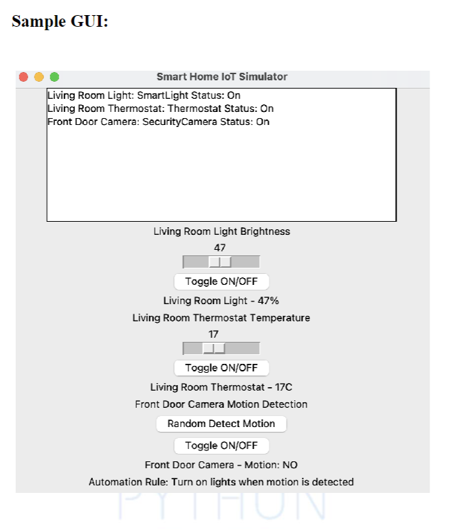
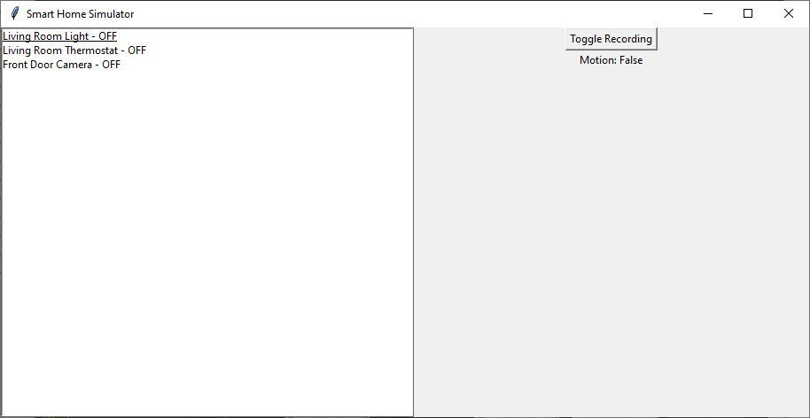

# Description
- In this assignment, you will need to develop a Python-based IoT simulator for a smart home automation system.
- The simulator should emulate the behaviour of various IoT devices commonly found in a smart home, such as smart lights, thermostats, and security cameras.
- You will also create a central automation system that manages these devices and build a monitoring dashboard to visualize and control the smart home.
- This assignment will help you apply your Python programming skills, including OOP, data handling, real-time data monitoring, and graphical user interfaces (GUIs)

# Objective
- Develop a Python-based IoT device simulator.
- Implement basic data analytics and processing.
- Create an eye-catching monitoring dashboard to display sensor data and analytics results.
- Use Python data structures, classes, OOP objects, instance and class variables, OOP methods, pip, static.
- methods, files & standard library, exception handling, modules, and packages.

# Requirements & Grading

## Part1: IoT Device Emulation (25 %)
### Device Classes
- **Device Classes**: Create Python classes for each type of IoT device you want to simulate, such as SmartLight, Thermostat, and SecurityCamera.
- Each class should have attributes like device ID, status (on/off), and relevant properties (e.g., temperature for thermostats, brightness for lights, and security status for cameras).
#### Device Behaviours
-  **Device Behavior**: Implement methods for each device class that allow for turning devices on/off and changing their properties.
- Simulate realistic behavior, such as gradual dimming for lights or setting temperature ranges for thermostats.
-  Randomization: Include a randomization mechanism to simulate changing device states and properties over time.

## Part 2: Central Automation System (25 %)
### Automation System and Automation Rule
- Automation System Class: Create a central automation system class, e.g., AutomationSystem, responsible for managing and controlling all devices.
- It should provide methods for discovering devices, adding them to the system, and executing automation tasks.
-  Simulation Loop: Implement a simulation loop that runs periodically (e.g., every few seconds) to trigger automation rules, update device states, and simulate device behaviors.
## Part 3: Documentation (30%)
- Documentation: Provide clear documentation for your code, including class descriptions, method explanations, and instructions on how to run the simulation and use the dashboard.
- Develop test cases to ensure that the simulator and automation system behave as expected.
- Test various scenarios, such as different automation rules and user interactions.
## Part 4: Monitoring Dashboard (20%)

### Tkinter
- Graphical User Interface (GUI): Create a GUI for monitoring and controlling the smart home system.
- You can use Python GUI libraries like Tkinter.
- The GUI should display the status and properties of each device, provide controls to interact with them, and visualize data.
-  Real-time Data Monitoring: Display real-time data from the simulated devices on the dashboard.
- This includes temperature graphs for thermostats, motion detection status for cameras, and brightness levels for lights.
-  User Interaction: Allow users to interact with devices through the GUI, such as toggling lights on/off, adjusting thermostat settings, and arming/disarming security cameras.

## Hints (See Tutorials Below for More Info):
-  While implementing the code, make sure you're writing docstrings for methods and classes. This way you can generate the documentation easily. 
-  Use Python's random library for generating sensor data.
-  Use a simulation loop for rule execution.
-  Design a GUI (try to be creative) using Tkinter.
-  Feel free to use ChatGPT, but make sure to be able understand and explain your solution!
-  Do not hesitate to ask your instructor for help and asking for the template for the GUI!

## Tutorials 

### Threading
[(32) Python Threading Tutorial: Run Code Concurrently Using the Threading Module - YouTube](https://www.youtube.com/watch?v=IEEhzQoKtQU)

### Tkinter
[(32) Tkinter Beginner Course - Python GUI Development - YouTube](https://www.youtube.com/watch?v=ibf5cx221hk)

### Unit Testing
[(32) Python Tutorial: Unit Testing Your Code with the unittest Module - YouTube](https://www.youtube.com/watch?v=6tNS--WetLI)
### Generating Documentation from DocString

[Python Docstrings (With Examples) (programiz.com)](https://www.programiz.com/python-programming/docstrings)
[Easy Documentation Generation in Python using PDoc. | by Daniel Ellis Research | CEMAC | Medium](https://medium.com/cemac/simple-documentation-generation-in-python-using-pdoc-16fb86eb5cd5)

### How to use packages and modules? & How to organize your code? 
[(32) 5 Tips To Organize Python Code - YouTube](https://www.youtube.com/watch?v=e9yMYdnSlUA)

## Sample GUI

## Sample Documentation
[src API documentation (ahmedelagami.github.io)](https://ahmedelagami.github.io/Smart_Home_Simulator_Documentation/)

## Execution Example

